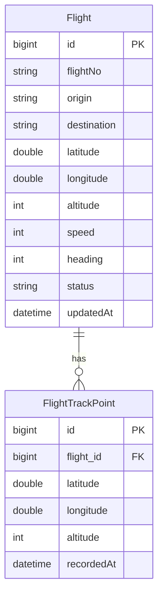
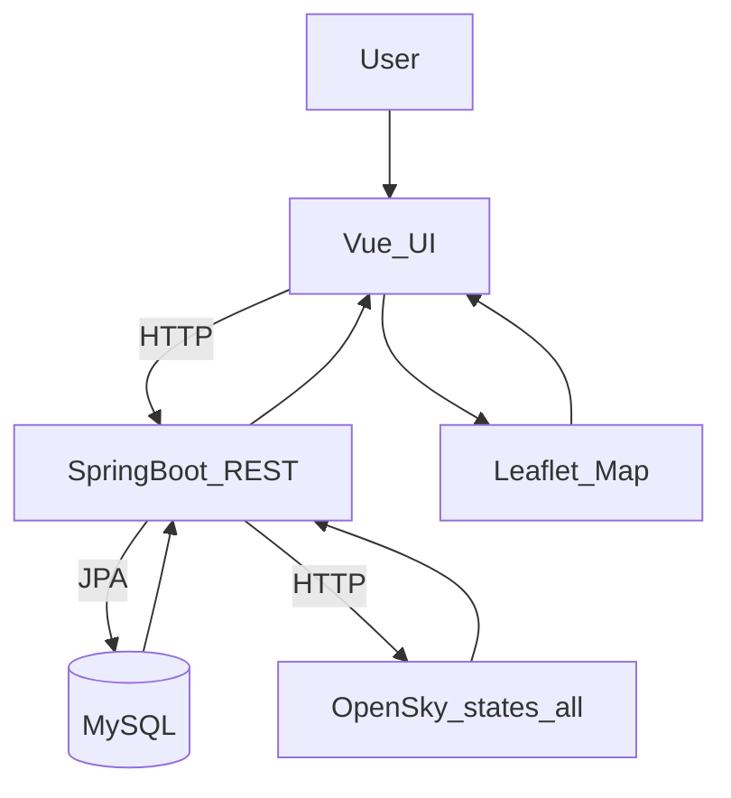
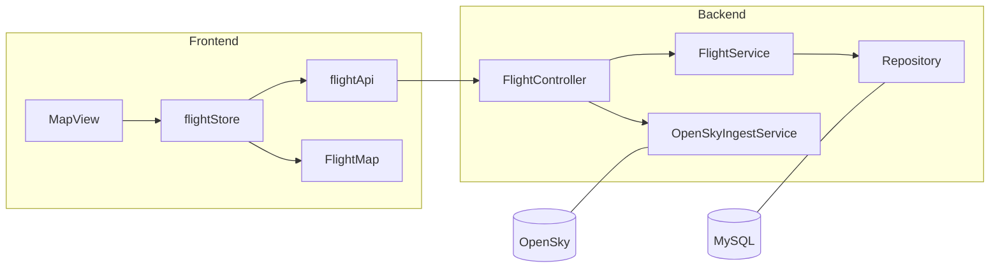
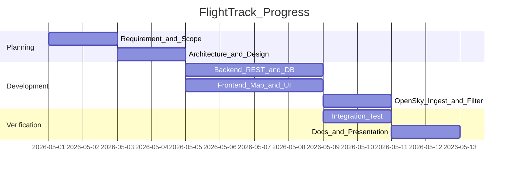

## 软件项目管理课程：项目大作业

**题目：基于 Vue 3 + Spring Boot 的航班信息跟踪平台（Flight Track）**  

**学    院**：计算机科学与技术学院  
**专    业**：软件工程  
**指导教师**：（请填写）  
**小组成员**：（请填写）  
**日    期**：二〇二六年五月  

---

## 摘要

随着民航运输规模增长与航班运行环境复杂化，航空信息的可视化呈现与动态跟踪已成为运行监控、教学演示与数据分析的基础能力。为满足课程项目对“前后端分离、数据接口设计、地图可视化与交互闭环”的综合要求，本项目设计并实现了一套航班信息跟踪平台。系统前端基于 Vue 3 + Vite，采用 Leaflet 完成地图展示与交互；后端基于 Spring Boot 3，采用 Spring Data JPA 与 MySQL 实现航班数据的持久化与 REST API 服务。

平台支持两种数据模式：（1）数据库预置航班：后端启动时自动初始化约 100 条航班数据与 30 个主要机场，前端在地图中展示飞机图标、航向旋转、航线虚线、航班搜索、机场面板等功能，并提供仿真倍速/暂停以展示航班运动过程；（2）OpenSky 实时数据：后端对 OpenSky `states/all` 接口进行拉取与采样（中国及周边 bbox、每国上限等可配置），前端定时刷新位置并支持“按起飞地筛选（最近机场近似）”，实现从“初始地图无飞机”到“筛选后显示航班”的交互闭环。

本系统实现了航班要素的统一建模、接口封装、地图渲染与状态管理联动，具备较好的可扩展性，可为后续扩展 WebSocket 实时推送、权限系统与统计分析等功能提供基础。

**关键词**：航班跟踪；地图可视化；Vue 3；Spring Boot；OpenSky；前后端分离

---

## Abstract

With the growth of civil aviation traffic and increasing operational complexity, visualizing and tracking flight information has become essential for monitoring, teaching demonstrations, and data analysis. To meet the course requirements on front–back separation, API design, and interactive geospatial visualization, this project designs and implements a flight tracking platform. The frontend is built with Vue 3 + Vite and uses Leaflet for map rendering and interactions; the backend is built with Spring Boot 3 and leverages Spring Data JPA and MySQL for persistence and REST APIs.

The platform supports two data modes: (1) **Database preset flights**: the backend initializes about 100 flights and 30 major airports at startup; the frontend displays aircraft icons with heading rotation, dashed route lines, flight search, airport panel, and simulation speed controls. (2) **OpenSky live flights**: the backend fetches and samples OpenSky `states/all` (China bbox and per-country caps are configurable); the frontend refreshes positions periodically and provides an “origin filter (nearest-airport approximation)”, enabling an interaction loop from an empty initial map to filtered live flights.

The system unifies domain modeling, API encapsulation, map rendering, and state management. It is extensible for future improvements such as WebSocket streaming, authentication/authorization, and analytics.

**Key words**: Flight tracking; Map visualization; Vue 3; Spring Boot; OpenSky; Frontend-backend separation

---

## 目录

- 1 绪论  
  - 1.1 研究背景  
  - 1.2 研究意义  
  - 1.3 国内外研究现状（简述）  
  - 1.4 本课题主要工作  
  - 1.5 本章小结  
- 2 系统开发工具与技术  
  - 2.1 系统开发工具  
  - 2.2 系统开发技术  
  - 2.3 本章小结  
- 3 需求分析  
  - 3.1 可行性分析  
  - 3.2 系统总体需求分析  
  - 3.3 主要业务分析  
  - 3.4 系统用例分析  
  - 3.5 系统 E-R 图分析  
  - 3.6 系统数据流图  
  - 3.7 本章小结  
- 4 系统设计  
  - 4.1 系统功能模块设计  
  - 4.2 数据库设计  
  - 4.3 本章小结  
- 5 系统详细设计与实现  
  - 5.1 后端 REST 与 OpenSky 数据接入实现  
  - 5.2 前端地图渲染与状态管理实现  
  - 5.3 OpenSky 按起飞地筛选实现（最近机场近似）  
  - 5.4 本章小结  
- 6 系统测试  
  - 6.1 测试环境  
  - 6.2 测试内容与用例  
  - 6.3 测试结果  
  - 6.4 本章小结  
- 7 总结与展望  
  - 7.1 工作总结  
  - 7.2 展望  
- 8 项目管理文档（补充）  
  - 8.1 需求说明书（尽量详尽）  
  - 8.2 详细设计补充（技术方案 / 功能设计 / 接口 / 数据库 / UI）  
  - 8.3 风险分析（技术/成本/进度/市场等）  
  - 8.4 组织分工  
  - 8.5 项目任务（活动）WBS 图及活动描述  
  - 8.6 成本估算  
  - 8.7 进度安排  
  - 8.8 测试报告（含各子模块）  
  - 8.9 试运行安排  
  - 8.10 系统正式部署及软硬件环境  
  - 8.11 售后服务  
- 参考文献  
- 致谢  

---

## 1 绪论

### 1.1 研究背景

民航运输系统具有典型的“强时空属性 + 高动态变化 + 多主体协同”的特征。航班在运行过程中会持续产生位置、航向、高度、速度、状态等关键要素，这些要素不仅用于航空公司运行监控、机场地面保障与空管协同，也广泛用于公众信息服务、教学演示与数据分析等场景。与传统的静态信息系统不同，航班运行数据需要以“时间连续”的方式被采集、传输、计算与展示，才能支持用户快速理解运行态势并进行进一步的查询与决策。

从数据链路角度看，航班信息通常具有多源异构特征：一方面来自 ADS-B/MLAT 等监视数据，另一方面来自航班计划、机场运行、气象等业务数据。不同来源的数据在字段命名、更新频率与可用范围上存在差异，若缺少统一的建模与接口封装，前端展示往往难以稳定迭代。因此，如何将航班要素进行抽象建模，构建稳定的后端服务接口，并在前端通过地图与交互控件直观呈现，是航班可视化系统设计中的核心问题。

在课程项目与教学实践中，航班跟踪平台是一类非常典型的综合型课题：

- 一方面，它要求完成端到端工程闭环（数据源→后端服务→前端可视化→交互反馈），能够系统性训练需求分析、架构设计、模块划分与接口规范能力；
- 另一方面，它天然适合通过地图可视化体现成果（飞机图标、航线、机场点、聚焦定位、筛选查询等），演示效果直观，便于验收与评审。

此外，开源数据平台（如 OpenSky Network）提供了可公开访问的航班状态向量接口，为课程项目提供了“真实数据接入”的可能性。基于此，本项目在“预置航班仿真展示”的基础上，进一步接入 OpenSky 真实数据，使系统能够在“仿真演示”和“真实数据刷新”两种模式间切换：在保证稳定演示效果的同时，也能验证接口设计与数据适配能力，从而提升项目的完整度与真实性。

### 1.2 研究意义

本课题的研究意义主要体现在工程实践、可视化表达与扩展研究三个方面：

- **工程实践意义**：
  - 通过前后端分离架构，将业务逻辑与展示层解耦，提升系统可维护性与可扩展性；
  - 以 REST API 为核心组织前后端协作，训练接口契约设计、DTO 映射、异常处理与跨域访问等工程能力；
  - 在前端采用组件化与状态管理思想，将地图渲染、详情展示、搜索筛选等功能拆分为可复用模块，降低复杂页面的耦合度。

- **数据可视化意义**：
  - 航班数据具有强时空特性，将其映射为地图符号（Marker/Polyline/Tooltip）能够显著降低理解成本；
  - 通过“选中高亮—详情面板—地图聚焦”的交互链路，实现从全局态势到局部对象的快速钻取；
  - 通过筛选与检索，将用户关注范围收敛到特定机场或特定航班，提升信息检索效率。

- **扩展研究意义**：
  - 系统在架构上预留了引入实时推送（WebSocket）、权限系统（JWT）、统计报表与多图层叠加（天气、告警）的扩展空间；
  - OpenSky 数据接入与采样策略的实现，为进一步研究“在限流条件下的抽样、缓存与刷新策略”提供实验基础；
  - “按起飞地筛选（最近机场近似）”提供了从真实数据推断业务标签的一种工程近似方法，可作为后续改进（地理围栏/航线库）的起点。

### 1.3 国内外研究现状（简述）

从研究与工程实践角度看，航班可视化与运行监控系统已经形成较成熟的技术路线。

- **国外研究与实践**：  
  国外在航空监视数据采集与共享方面起步较早，围绕 ADS-B、MLAT 等数据建立了较完善的采集—处理—分发体系。OpenSky Network 作为具有代表性的开放平台之一，提供了面向研究与工程验证的 REST API，可获取状态向量（位置、速度、航向等）并支持一定范围的数据查询。围绕这些数据源，研究者通常关注数据质量评估、轨迹重建、异常检测、拥堵预测与可视化交互等方向。

- **国内研究与实践**：  
  国内在航班信息展示、机场运行监控与航司运控系统方面也有大量应用，但由于数据源涉及行业系统与监管体系，公开接口与可复现数据相对有限。公开场景中更多以“航班信息展示与态势感知”为主，强调交互体验与展示效果。对课程项目而言，使用开放数据源进行可验证实现，能够兼顾工程可落地与成果可复现。

综合来看，航班信息跟踪系统的关键难点主要在于：数据源获取与稳定性、数据字段适配、实时刷新策略、地图渲染性能与交互设计。本项目在课程约束下，采用“预置数据稳定演示 + OpenSky 数据接入验证”的组合策略，以较小成本覆盖上述关键点。

### 1.4 本课题所做的主要工作

围绕上述目标，本课题完成的主要工作包括：

1. **系统架构设计与工程搭建**：完成前后端分离工程搭建，明确模块边界与目录结构，形成可持续迭代的工程骨架。
2. **领域模型与持久化实现**：设计航班实体与轨迹点实体，采用 MySQL 进行持久化存储；后端启动时初始化预置航班数据，保证演示稳定性。
3. **REST API 设计与实现**：实现航班列表、航班详情与轨迹查询接口，完成 DTO 映射与跨域配置，支持前端稳定访问。
4. **前端地图可视化实现**：基于 Leaflet 构建地图主界面，完成机场点、飞机图标、航线虚线渲染；实现点击选中、高亮、Tooltip 与详情弹窗等交互。
5. **检索与聚焦交互实现**：实现顶栏搜索与机场面板两种入口，支持从不同视角定位并关注目标航班。
6. **仿真展示能力实现（预置数据模式）**：实现前端仿真时钟、倍速控制、落地与重生逻辑，使航班运动展示连续可观。
7. **OpenSky 数据接入与刷新策略**：后端拉取 OpenSky `states/all` 并进行采样；前端以轮询方式刷新位置，保证在匿名限流条件下仍可展示真实数据。
8. **OpenSky 起飞地筛选（最近机场近似）**：实现“初始地图无飞机 + 多选筛选后显示”的交互闭环，按飞机当前位置匹配最近机场用于归类，满足按起飞地查看航班状态的展示需求。

### 1.5 本章小结

本章围绕航班信息跟踪与可视化的应用背景，阐述了开展本课题研究的必要性与价值，并从工程实践、可视化表达与扩展研究三个层面说明了系统建设意义。同时对国内外相关方向的技术路线与难点进行了简要归纳，明确本项目采用“预置数据稳定演示 + OpenSky 真实数据接入验证”的实现思路。最后给出本文的主要工作内容，为后续章节的需求分析与系统设计奠定基础。

---

## 2 系统开发工具与技术

### 2.1 系统开发工具

- **集成开发环境**：IntelliJ IDEA / VS Code（任一均可完成后端与前端开发）
- **数据库管理工具**：Navicat / DataGrip / MySQL Workbench（用于表结构与数据查看）
- **版本管理工具**：Git + GitHub（分支协作与提交规范）
### 2.2 系统开发技术

- **Vue 3 + Vite**：组件化、响应式与工程化构建
- **Leaflet**：地图渲染、图层管理、Marker/Polyline 交互
- **Axios**：前后端 HTTP 通信
- **Spring Boot 3**：快速搭建后端 REST 服务
- **Spring Data JPA / Hibernate**：ORM 持久化与实体映射
- **MySQL 8**：关系型数据存储
### 2.3 本章小结

本章介绍了本系统开发过程中使用的主要工具与核心技术栈，包括前端 Vue 3 + Vite、地图可视化 Leaflet、通信组件 Axios，以及后端 Spring Boot、JPA/Hibernate 与 MySQL 等。通过对工具链与技术选型的说明，明确了系统在工程化构建、数据访问与可视化展示方面的技术基础，为后续的需求分析、系统设计与实现细节提供支撑。

---

## 3 需求分析

### 3.1 可行性分析

#### 3.1.1 技术可行性

系统采用成熟的 Vue 3、Spring Boot、MySQL 与 Leaflet 技术栈，生态完善、文档齐全，能够支撑地图可视化、REST 接口与基本的工程扩展需求。OpenSky 提供公共 REST API，可作为真实数据来源进行验证。

#### 3.1.2 操作可行性

系统采用地图主界面 + 顶栏搜索/筛选 + 侧栏详情面板的交互模式，符合“先全局观察，再局部聚焦”的认知路径；支持一键刷新、复位与搜索定位，降低用户学习成本。

#### 3.1.3 经济可行性

项目全部使用开源技术与免费开发工具，成本主要为开发时间与本机环境搭建成本；OpenSky 匿名请求可满足课程演示（受限于配额与延迟），可选用账号以获得更高配额。

### 3.2 系统总体需求分析

#### 3.2.1 适用对象

- **课程评审/指导教师**：验证系统架构、功能完整性与文档质量
- **学生用户（演示使用）**：通过地图界面查看航班状态与动态变化
#### 3.2.2 系统功能需求分析

（1）航班展示
- 展示飞机标记、航向旋转与选中高亮
- 展示起点→终点虚线航线（选中时高亮）

（2）交互与检索
- 航班搜索：按航班号/出发地/目的地模糊搜索，定位并高亮
- 航班详情弹窗：展示高度、速度、航向、坐标、起止信息
- 机场面板：展示某机场出发/到达航班列表并支持定位

（3）数据模式
- MySQL 预置数据：启动自动初始化，支持前端仿真倍速/暂停
- OpenSky 实时数据：周期刷新位置
- OpenSky 起飞地筛选：初始无飞机，多选起飞地后显示

（4）接口能力
- `GET /api/flights`：飞行中航班列表（MySQL）
- `GET /api/flights/opensky`：OpenSky 航班列表（bbox、采样策略可配置）
- `GET /api/flights/{id}`：航班详情
- `GET /api/flights/{id}/track`：历史轨迹
#### 3.2.3 系统性能需求分析（课程级）

- 页面首次可用：前端启动后可在数秒内加载地图与 UI
- 刷新与筛选：应在可接受时间内完成（受 OpenSky 网络响应影响）
- 稳定性：接口异常时前端可降级到 Mock（或提示错误）
### 3.3 主要业务分析

#### 3.3.1 航班检索与定位流程

用户输入关键词 → 前端从当前航班列表中过滤 → 选择结果 → 设置 `focusFlightId` → 地图平移缩放到航班位置并高亮。

#### 3.3.2 OpenSky 起飞地筛选流程（最近机场近似）

默认 `selectedOrigins=[]` → 地图无飞机  
用户打开“起飞地”多选 → 勾选机场 → 前端请求 `/api/flights/opensky` → 对每架飞机计算最近机场 → 按选择过滤 → 渲染飞机与航线 → 定时轮询刷新并保持过滤。

### 3.4 系统用例分析

#### 3.4.1 顶层用例图（文字版）

- 查看航班（列表/地图）
- 搜索航班并定位
- 查看航班详情
- 查看机场出发/到达航班并定位
- 选择数据源模式（MySQL/OpenSky）
- OpenSky：按起飞地筛选
### 3.5 系统 E-R 图分析

本项目核心实体为航班与轨迹点，两者为 1:N 关系（一个航班对应多条轨迹点）。

### 3.6 系统数据流图

### 3.7 本章小结

本章从可行性分析出发，明确了系统在技术、操作与经济层面的可实现性；随后对功能需求、性能需求与主要业务流程进行了分解说明，并通过用例、E-R 图与数据流图对“数据如何产生—如何处理—如何展示”的链路进行了结构化描述。通过本章的分析，系统的目标用户、核心功能范围与数据组织方式已得到清晰界定，为下一章的总体设计与模块划分提供依据。

---

## 4 系统设计

### 4.1 系统功能模块设计

系统按前后端分离设计，主要模块如下：

- **前端展示层**：地图组件（机场/飞机/航线）、顶栏（搜索/筛选/统计/时钟）、详情弹窗与机场面板
- **前端状态层**：航班列表状态、选中态、OpenSky 轮询、起飞地筛选派生
- **后端服务层**：航班查询、轨迹查询、OpenSky 拉取与采样
- **数据层**：MySQL 航班/轨迹点表

### 4.2 数据库设计

数据库采用两张核心表（可扩展更多字段/索引）：

- `flights`：航班主表（flightNo、起止、位置、速度、状态等）
- `flight_track_points`：轨迹点表（航班外键、经纬度、高度、记录时间）
### 4.3 本章小结

本章在需求分析结论基础上完成了系统总体设计：给出了前后端分离架构下的模块划分与主要模块职责，明确了前端展示层、状态层与后端服务层、数据层之间的协作方式；同时对数据库核心表结构进行了说明，保证航班主数据与轨迹数据能够被规范存储与查询。通过本章设计，系统实现的关键路径与数据支撑已具备，为下一章的详细设计与实现奠定框架基础。

---

## 5 系统详细设计与实现

### 5.1 后端 REST 与 OpenSky 数据接入实现

后端采用 `controller/service/repository/dto/entity` 分层。

- **MySQL 航班数据**：`GET /api/flights` 返回 `IN_FLIGHT` 航班列表；`GET /api/flights/{id}` 返回单航班；`GET /api/flights/{id}/track` 返回轨迹点。
- **OpenSky 接入**：后端请求 OpenSky `states/all`（中国 bbox），对结果做采样（每国上限等可配），并映射为 `FlightDTO` 返回给前端。

OpenSky 返回的 state vectors 不含“真实出发机场”，因此系统仅将其作为“实时位置”来源，并在前端基于最近机场近似进行起飞地分类。

### 5.2 前端地图渲染与状态管理实现

前端采用 Vue 3 组合式 API。

- `flightStore` 负责航班数据加载、OpenSky 轮询、选中态与聚焦逻辑。
- `FlightMap` 负责 Leaflet 地图初始化、Marker 与 Polyline 绘制更新。
- `MapView` 负责顶栏搜索、统计时钟与筛选入口。

为避免筛选或刷新造成残留，地图端会在数据更新时重绑 marker，并清理已消失的航线。

### 5.3 OpenSky 按起飞地筛选实现（最近机场近似）

为满足“初始地图无飞机 + 多选筛选”的交互要求，实现策略如下：

- `selectedOrigins=[]` 时：不请求 OpenSky，`flights=[]`。
- 用户选择起飞地后：拉取 `/api/flights/opensky`，对每架飞机计算 `nearestAirport`（遍历 30 个机场取最小距离），再按 `selectedOrigins` 过滤为 `flights`。
- 轮询刷新：每次刷新同样先更新 `flightsAll`，再过滤得到 `flights`。

该策略在课程演示层面可解释为：“在中国空域内，以主要机场作为参照点，将附近航班归入对应起飞地类别”。注意这是一种近似归类，不等价于真实起飞机场。

### 5.4 本章小结

本章围绕“系统如何落地实现”展开，分别说明了后端 REST 接口的分层实现方式、OpenSky 数据接入与采样策略，以及前端地图渲染与状态管理的联动机制。在此基础上给出了 OpenSky 模式下“初始无飞机 + 起飞地筛选（最近机场近似）”的实现流程，形成从数据获取到地图展示再到交互反馈的完整闭环。通过本章的实现说明，系统关键功能点与核心代码组织方式得到清晰呈现。

---

## 6 系统测试

### 6.1 测试环境

- OS：Windows 10/11
- JDK：21
- Node.js：18+
- MySQL：8.0+
- 浏览器：Chrome / Edge
### 6.2 测试内容与用例（节选）

| 编号 | 用例 | 预期结果 |
|---|---|---|
| T01 | 启动后端、前端访问首页 | 页面正常加载地图与顶栏 |
| T02 | MySQL 模式加载航班 | 地图出现飞机、航线；可点击查看详情 |
| T03 | 搜索航班号并回车 | 地图定位并高亮目标航班 |
| T04 | 点击机场点 | 左侧机场面板显示出发/到达航班列表 |
| T05 | OpenSky 模式初始进入 | 地图无飞机（未选择起飞地） |
| T06 | OpenSky 勾选 1-3 个起飞地 | 地图显示对应分类飞机，轮询刷新后仍保持过滤 |
| T07 | 清空起飞地筛选 | 地图立即清空飞机并停止请求 |
### 6.3 测试结果

经手工测试，上述用例均满足预期；当 OpenSky 网络或配额导致接口异常时，前端会输出告警日志，便于定位问题。

### 6.4 本章小结

本章给出了系统测试所需的环境配置，并围绕核心功能设计了若干关键测试用例，覆盖 MySQL 预置数据模式与 OpenSky 实时数据模式下的加载、检索、筛选与交互流程。测试结果表明系统主要功能能够按预期运行，关键交互链路（搜索定位、机场面板定位、OpenSky 起飞地筛选等）有效可用。同时，本章也为后续优化（性能、异常提示与实时推送）提供了验证基础。

---

## 7 总结与展望

### 7.1 工作总结

本项目完成了航班信息跟踪平台的端到端实现：后端完成航班数据模型、持久化与 REST API，并接入 OpenSky 实时数据；前端完成地图可视化、航班检索、详情展示、机场面板，以及 OpenSky 模式下“初始无飞机 + 起飞地筛选”的交互闭环。系统结构清晰、模块划分明确，具备继续扩展的基础。

### 7.2 展望

- **WebSocket 推送**：后端定时推送航班位置，前端实时更新，减少轮询开销
- **权限与账号系统**：引入 Spring Security + JWT，实现多角色与管理功能
- **统计与报表**：航班数量、机场繁忙度、时间分布等可视化报表
- **更真实的起飞地/目的地推断**：结合航线库或机场地理围栏进行更合理归类
---

### 7.3 本章小结

本章对本项目的整体工作进行了归纳总结，回顾了系统在“后端数据建模与接口服务—前端地图可视化—OpenSky 数据接入与筛选交互”方面的主要成果，并结合当前实现指出了后续可改进方向，包括实时推送机制、权限与账号体系、统计分析能力以及更准确的起降地推断方法。通过对展望的提出，进一步明确了系统在课程项目基础上的可持续扩展路线。

---

## 8 项目管理文档（补充）

本章为满足课程项目管理作业的交付要求，对“需求说明书、详细设计、风险分析、组织分工、WBS、成本、进度、测试、试运行、部署环境、售后服务”等管理类内容进行结构化补充。其技术内容均基于本仓库当前实现（Vue 3 + Leaflet 前端、Spring Boot + MySQL 后端、OpenSky 数据接入与筛选）。

### 8.1 需求说明书（尽量详尽）

#### 8.1.1 项目范围（Scope）

- **系统名称**：航班信息跟踪平台（Flight Track）
- **目标**：提供面向课程演示与学习的航班态势可视化平台，实现航班数据获取、地图展示与交互检索的闭环。
- **边界**：本系统不承担真实航司运控/空管业务，仅做信息展示与课程级验证；OpenSky 数据不保证完整与实时性。

#### 8.1.2 角色与使用场景

- **演示用户（学生/老师）**：打开系统查看航班态势；通过搜索/筛选定位目标航班；查看航班详情。
- **开发维护者**：配置数据库、启动前后端、调整 OpenSky 配置与采样策略、定位运行问题。

#### 8.1.3 功能性需求（Functional Requirements）

**A. 数据获取与模式切换**

- **FR-A1**：系统支持 MySQL 预置航班数据模式（后端初始化，前端加载展示）。
- **FR-A2**：系统支持 OpenSky 数据模式：后端拉取 `states/all`（中国 bbox），按采样策略返回航班状态向量；前端定时轮询刷新。
- **FR-A3**：OpenSky 模式支持“按起飞地筛选（最近机场近似）”：初始无飞机；选择起飞地后才加载并显示。

**B. 地图展示**

- **FR-B1**：地图显示机场点位（固定机场集 `AIRPORTS`）。
- **FR-B2**：地图显示飞机图标（随航向旋转、选中高亮）。
- **FR-B3**：地图显示航线虚线（起点→终点；选中航班航线高亮）。

**C. 交互与检索**

- **FR-C1**：点击飞机显示详情弹窗（航班号/高度/速度/航向/坐标/起止信息/状态）。
- **FR-C2**：顶栏搜索支持按航班号/出发地/目的地模糊查询，选中后地图聚焦并高亮。
- **FR-C3**：点击机场显示机场面板（出发/到达航班列表），点击列表行可定位对应飞机。
- **FR-C4**：提供刷新与复位控制。

**D. 仿真（仅 MySQL/Mock 模式）**

- **FR-D1**：提供仿真速率控制（暂停、1×、2×、5×、10×）。
- **FR-D2**：飞机沿航线插值飞行；接近目的地进入落地状态并重生新航线。

#### 8.1.4 非功能需求（Non-functional Requirements）

- **NFR-1 可用性**：首次打开页面可快速看到地图；交互路径清晰（搜索/筛选/选中/详情）。
- **NFR-2 性能**：在课程演示规模（数百以内 marker）下保持流畅；OpenSky 采样策略可调以控制数据量。
- **NFR-3 稳定性**：OpenSky 网络/限流异常时，前端能提示或降级（console 警告）。
- **NFR-4 可维护性**：前后端分层、模块职责清晰；配置项集中管理。
- **NFR-5 安全性（课程级）**：仅开发环境部署；CORS 白名单限制本地前端来源。

### 8.2 详细设计补充（技术方案 / 功能设计 / 接口 / 数据库 / UI）

#### 8.2.1 技术方案（Architecture & Key Design)

- **总体架构**：前后端分离（Vue 3 SPA）+ REST API（Spring Boot）+ MySQL 持久化。
- **OpenSky 数据策略**：后端拉取 → 过滤无位置与在地面航空器 → 采样（每国上限、网格均衡抽样）→ DTO 输出；前端按轮询周期刷新并保持筛选。
- **前端状态策略**：`flightStore` 维护 `flightsAll`（OpenSky 原始）与 `flights`（筛选后展示），以降低 UI 与数据源耦合。

#### 8.2.2 详细功能设计（模块级）

- **地图模块**（`FlightMap.vue`）：负责 Leaflet 初始化、机场 marker 绘制、飞机 marker 绘制与更新、航线 polyline 管理、地图聚焦与高亮。
- **状态模块**（`flightStore.js`）：负责数据加载、OpenSky 轮询、筛选派生、选中态、仿真 tick（非 OpenSky）。
- **交互模块**（`MapView.vue`）：负责顶栏搜索、起飞地筛选入口、统计信息与系统时钟。
- **详情模块**（`FlightPopup.vue` / `AirportPanel.vue`）：负责航班/机场上下文信息展示与定位联动。

#### 8.2.3 后端接口设计（REST API）

| 方法 | 路径 | 说明 | 关键响应字段 |
|---|---|---|---|
| GET | `/api/flights` | MySQL：获取飞行中航班列表 | `id,flightNo,origin,destination,latitude,longitude,altitude,speed,heading,status,updatedAt` |
| GET | `/api/flights/{id}` | MySQL：获取单航班详情 | 同上 |
| GET | `/api/flights/{id}/track` | MySQL：获取历史轨迹点 | `[{latitude,longitude}]` |
| GET | `/api/flights/opensky` | OpenSky：bbox 内抽样航班 | 以上字段 + `icao24,origLat,origLng,destLat,destLng,routeProgress` |

#### 8.2.4 数据库/文件设计

**数据库表设计（MySQL）**

- `flights`：航班主表（以 `flightNo` 唯一约束），存储航班基本字段与最新状态。
- `flight_track_points`：轨迹点表，记录某航班每次更新位置（用于轨迹查询与扩展）。

**数据初始化文件**

- `backend/src/main/resources/data.sql`：启动时插入预置航班数据，保证演示稳定性。

#### 8.2.5 UI 设计（界面结构说明）

由于本项目以课程演示为主，UI 采用“顶栏 + 地图主视图 + 侧栏面板”的经典态势系统布局：

- **顶栏**：系统标题、航班搜索框、（OpenSky 模式）起飞地多选筛选、在线数量/飞行中数量、系统时钟。
- **地图区域**：底图 + 机场点 + 飞机 + 航线；左上角刷新/复位；左下角图例；（非 OpenSky）底部仿真倍速条。
- **右侧弹窗**：航班详情（点击飞机出现）。
- **左侧面板**：机场详情（点击机场点出现）。

### 8.3 风险分析（技术/成本/进度/市场等）

| 风险类别 | 风险描述 | 影响 | 应对策略 |
|---|---|---|---|
| 技术 | OpenSky 匿名接口限流/延迟导致返回不稳定 | 演示时无数据或刷新失败 | 提供采样配置与轮询间隔；必要时配置账号；保留 MySQL 预置数据模式作为兜底 |
| 技术 | “起飞地=最近机场”仅为近似，可能引起逻辑争议 | 展示结果与直觉不一致 | 在文档与 UI 解释“近似归类”；后续可引入地理围栏或航线库改进 |
| 技术 | marker 数量过多导致前端卡顿 | UI 卡顿/崩溃 | 后端采样（每国上限/网格均衡）与 bbox 限制；前端按需显示（默认无飞机） |
| 进度 | 功能扩展过多导致延期 | 任务未完成 | 以“核心闭环”优先；将扩展项放入展望；每阶段可演示 |
| 成本 | 学生时间成本不足 | 影响质量 | 使用成熟框架与现成组件；复用代码；控制需求范围 |
| 市场/应用 | 真实业务需要更严格数据源与合规 | 不适合直接商用 | 明确课程性质与演示边界；不宣称真实运控能力 |

### 8.4 组织分工

若以 3～4 人小组为例（可按你们实际成员调整）：

- **项目经理/文档负责人**：进度推进、需求与文档统一、验收材料整理。
- **后端负责人**：实体/仓储/服务/控制器、数据库配置、OpenSky 接入与采样策略。
- **前端负责人**：地图渲染、组件交互、UI 样式、状态管理。
- **测试与集成负责人**：联调验证、测试用例与测试报告、演示脚本与试运行安排。

### 8.5 项目任务（活动）WBS 图及活动描述

#### 8.5.1 WBS（Mermaid）

```mermaid
flowchart TB
  Root[FlightTrack_Project]
  Root --> Req[Requirement_Analysis]
  Root --> Design[System_Design]
  Root --> Backend[Backend_Dev]
  Root --> Frontend[Frontend_Dev]
  Root --> Integrate[Integration_Test]
  Root --> Deploy[Trial_Run_Deploy]
  Root --> Docs[Docs_Delivery]

  Req --> Req1[Scope_and_Functions]
  Req --> Req2[UseCases_and_Flows]

  Design --> D1[Architecture]
  Design --> D2[API_Spec]
  Design --> D3[DB_Schema]
  Design --> D4[UI_Layout]

  Backend --> B1[Entities_JPA]
  Backend --> B2[REST_APIs]
  Backend --> B3[OpenSky_Ingest_Sampling]

  Frontend --> F1[Leaflet_Map_Layers]
  Frontend --> F2[Search_and_Focus]
  Frontend --> F3[AirportPanel_and_Popup]
  Frontend --> F4[OpenSky_Filter_UI]

  Integrate --> T1[Unit_Smoke]
  Integrate --> T2[Manual_Test_Cases]
  Integrate --> T3[Bug_Fix]

  Deploy --> P1[Env_Config]
  Deploy --> P2[Trial_Run_Script]

  Docs --> Doc1[Requirement_Spec]
  Docs --> Doc2[Design_Doc]
  Docs --> Doc3[Test_Report]
```

#### 8.5.2 关键活动描述（示例 6 项）

1. **OpenSky 数据接入与采样**：后端拉取 state vectors，过滤无效数据并按采样策略输出，保证前端可展示且规模可控。  
2. **航班 REST 接口实现**：完成 `/api/flights`、`/{id}`、`/{id}/track`，确保前端与数据库联动。  
3. **地图多图层渲染**：机场/飞机/航线分层渲染，支持高亮与 tooltip。  
4. **搜索定位与选中详情**：实现搜索过滤、地图聚焦、详情弹窗与状态联动。  
5. **OpenSky 起飞地筛选闭环**：初始无飞机，多选筛选后展示并持续轮询刷新。  
6. **联调测试与演示脚本**：按用例验证功能，准备试运行与课堂演示流程。  

### 8.6 成本估算

以课程项目为例，成本主要为人力成本（时间）。假设 4 人小组、2 周迭代：

- **需求与设计**：4 人 × 6 小时 = 24 人时
- **后端开发**：1 人 × 18 小时 = 18 人时
- **前端开发**：1 人 × 22 小时 = 22 人时
- **OpenSky 接入与筛选**：1 人 × 12 小时 = 12 人时
- **联调与测试**：1 人 × 14 小时 = 14 人时
- **文档整理与答辩材料**：2 人 × 8 小时 = 16 人时

合计约 **106 人时**（可按实际调整）。软硬件成本方面，本系统依赖开源软件与本地开发环境，额外成本接近 0。

### 8.7 进度安排

示例进度（可按课程周次调整）：

### 8.8 测试报告（含各子模块）

#### 8.8.1 测试范围

- **后端模块**：航班列表/详情/轨迹接口；OpenSky 拉取与采样接口；跨域配置。
- **前端模块**：地图渲染、Marker/航线绘制、搜索定位、机场面板、航班详情弹窗、OpenSky 起飞地筛选。
- **集成链路**：前端请求后端、数据映射与展示、轮询刷新与筛选保持。

#### 8.8.2 子模块测试结论（摘要）

- **地图渲染模块**：机场与飞机均可正常渲染；筛选切换后 marker/航线无残留。
- **搜索定位模块**：关键词过滤正确；回车/点击可聚焦并高亮。
- **详情弹窗模块**：字段显示正常；关闭与选中态联动正确。
- **机场面板模块**：出发/到达列表正确；点击可定位并高亮。
- **OpenSky 模块**：默认无飞机；选择起飞地后加载并定时刷新；异常情况下给出告警日志。

（详细用例表格见第 6 章，可在此扩展更多用例与截图。）

### 8.9 试运行安排

- **试运行目标**：验证在课堂演示环境中“启动—选择模式—筛选—查询—展示”的完整流程稳定可用。
- **试运行步骤**：\n  1) 启动 MySQL 与后端服务；\n  2) 启动前端；\n  3) MySQL 模式：查看预置航班、搜索与机场面板；\n  4) OpenSky 模式：选择起飞地后加载、观察轮询刷新；\n  5) 记录问题并回归修复。\n- **试运行时间**：建议答辩前 1～2 天进行至少 2 次完整试运行。

### 8.10 系统正式部署及软硬件环境

#### 8.10.1 软件环境

- JDK：21
- Maven：3.9+
- Node.js：18+
- MySQL：8.0+
- 浏览器：Chrome/Edge

#### 8.10.2 硬件环境（课程级）

- CPU：双核及以上
- 内存：8GB 及以上（推荐 16GB，OpenSky 数据刷新更流畅）
- 网络：能访问 OpenSky 接口（若网络受限可使用 MySQL 预置模式演示）

#### 8.10.3 部署方式（建议）

- **开发/演示部署**：本地运行（后端 `mvn spring-boot:run`，前端 `npm run dev`）。
- **可选生产式部署**：前端 `npm run build` 生成静态文件，后端打包 jar 后部署；数据库使用独立 MySQL 实例；通过 Nginx 反向代理统一入口（课程项目可不做强制要求）。

### 8.11 售后服务

课程项目可将“售后服务”理解为“运行维护与支持计划”：

- **问题反馈渠道**：GitHub Issues / 小组沟通群（按课程要求选择）。
- **响应时间**：演示期内（提交至答辩）24 小时内响应；答辩当天优先级最高。
- **维护内容**：接口异常修复、前端兼容性问题修复、配置说明更新、演示脚本更新。
- **版本管理**：采用 Git 版本管理与提交规范；重大改动以 tag 标记可演示版本。

## 参考文献

（以下为写作示例，你可按课程要求补全）

[1] OpenSky Network. OpenSky REST API Documentation.

[2] Spring Boot Reference Documentation.

[3] Vue.js Documentation.

[4] Leaflet Documentation.

[5] MySQL 8.0 Reference Manual.
---

## 致谢

感谢课程教师与助教在项目选题、需求分析与实现路径上的指导；感谢开源社区提供的 Vue、Spring Boot、Leaflet 与 OpenSky 等工具与平台支持。
